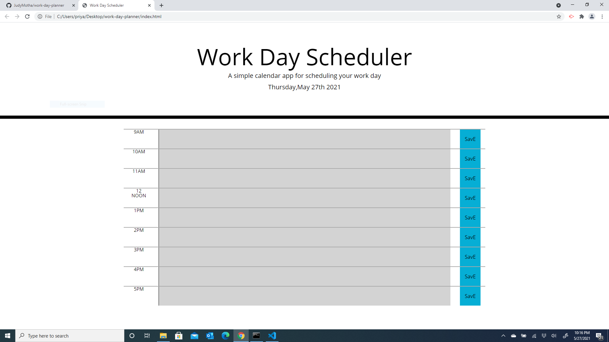
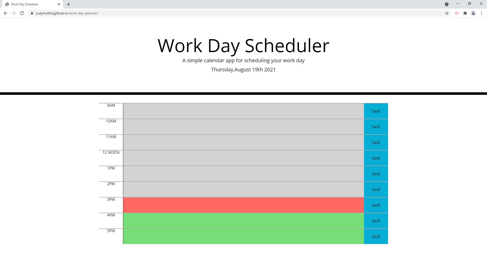
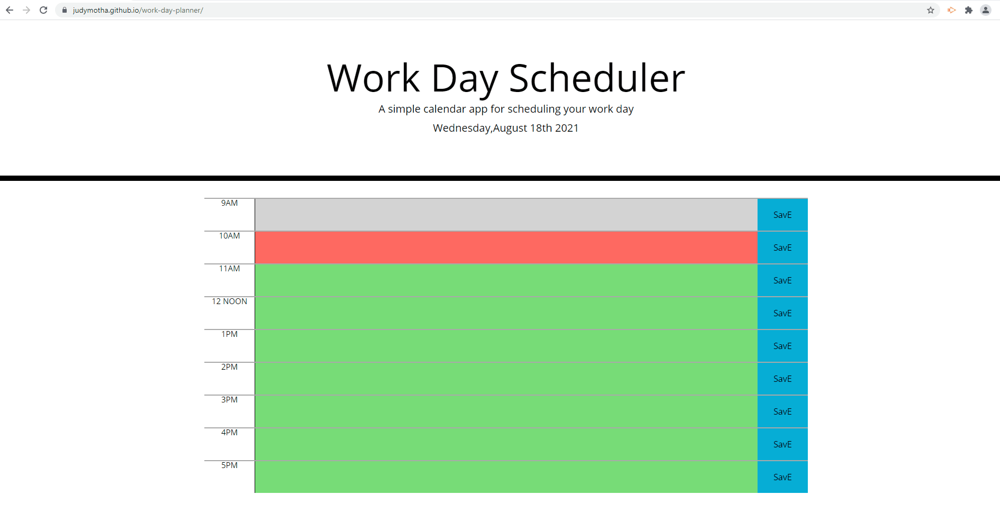

# Work-day-planner

The application does the following -

* the current day/date is displayed in main heading area
* the application provides timeblocks for standard business hours
* timeblock is color coded to indicate whether it is in the past(Grey), presen(Red), or future(Green) depending upon the time(moment) you visit this application
* The user is allowed to enter an event/text and click save button
* The text for that event is saved in local storage and remains on app page when refreshed
* Technology :HTML,CSS,Javascript,JQuery,Moment JS

* DEployed Link https://judymotha.github.io/work-day-planner/
* GH link https://github.com/JudyMotha/work-day-planner

# Visual:
# Screenshot 
* Note:Screenshot1 - Shows Workday Planner with time that has gone past ; and Screenshot 2 shows time past,present and future

# GIF file

